# Ureka secure framework in ARM M2354 Board (Cortex-M23, with TrustZone & related hardware security features)

> The Ureka framework is a user-centric security framework that prioritizes the protection of user devices and data through comprehensive authentication, authorization, and auditing functions.
 
> The Ureka framework is embeddd in the device and the user agent, so that only authorized agents can access the device and the stored data.

## Testing Environment

+ Device: A Nuvoton M2354 develeopment board.
  + Target Platform:
    + Hardware: [Nuvoton M2354 (ARM Cortex-M23)](https://www.nuvoton.com/products/microcontrollers/arm-cortex-m23-mcus/m2354-series/)
    + Board Support Packages (BSP) Version: [NuMaker-M2354 BSP (v3.00.004)](https://github.com/OpenNuvoton/M2354BSP/tree/v3.00.004)
  + Development Host:
    + Hardware: ASUSTek AMD Ryzen 7 6800H, x64
    + Platform: Windows (Win11)
    + Toolchain (Build Tool + Editor IDE): Keil uVision (Keil MDK-ARM 5.41, with Nuvoton CMSIS-Packs)
    + Programming Language: C11 + Cpp11
    + Code Formatter: None
+ Agent(s): A computer which simultaneously manage many agents (so that simplify the testing). 
  + Target Platform + Development Host:
    + Hardware: ASUSTek AMD Ryzen 7 6800H, x64
    + Platform: Windows (Win11)
    + Toolchain (Build Tool + Editor IDE): VSCode (v1.96.4)
    + Programming Language: Python 3.13.1
    + Package Management: venv + pip
    + Code Formatter: Black
+ Communication between Device and Agent(s)
  + Serial Communication: To simplify the testing, we install [PySerial](https://github.com/pyserial/pyserial) in Agent(s) to communicate with the device through the virtual COM port.
+ Testing
  + The Unit Tests of the Ureka C++ library used in the M2354 and the Ureka Python library used in the Agent(s) have been tested. 
  + However, the Integration Tests on the Target Platform (i.e. when runing the M2354) are not yet built.
  + To accelerate the development cycle and improve quality, more comprehensive tests should be added...

## Project Structure

```
Ureka-NuMaker-M2354
├── Agent: Python Project (can simulate multiple agents)
│   ├── ureka_framework: Ureka Python Library
│   ├── voting_emulation.py: An emulation for run a voting sceanrio
│   ├── requirements_xxx.txt: Required Python packages
│   └── ...
├── Device: M2354 TrustZone Project
│   ├── Library_BSP: Required NuMaker M2354 Board Support Packages
│   │   ├── CMSIS
│   │   ├── Device
│   │   └── StdDriver
│   ├── Library_ThirdParty: Required Third Party Libraries
│   │   └── Ureka: Ureka C++ Library
│   ├── NonSecure
│   │   ├── KEIL: Keil Toolchian NonSecure Project
│   │   ├── main_ns.c:　NonSecure Main Program
│   │   └── ...
│   ├── Secure
│   │   ├── KEIL: Keil Toolchian Secure Project
│   │   ├── lib: Library for TrustZone
│   │   ├── main.cpp: Secure Main Program, protect a device run a voting sceanrio
│   │   └── ...
│   ├── partition_M2354.h: Partition file for TrustZone
│   ├── TrustZone.uvmpw: Keil Project File
│   ├── TrustZone.uvmpw.uvgui.xxx: Developer-specific Keil GUI Conf.
│   └── ...
├── Doc: Document Images
└── README.md
```

## Get Started

### Setup M2354 Device
  + #### Tutorial
    + [Arm Keil Microcontroller Development Kit (MDK) Getting Started Guide](https://developer.arm.com/documentation/109350/v6/?lang=en)
    + [NuMaker-M2354 User Manual (Quick start from P28)](https://www.nuvoton.com/export/resource-files/UM_NuMaker-M2354_EN_Rev1.pdf)
  + #### Build & Load the Code into M2354 board: (all GUI operaions in Keil)
    + $ Enter Device/
      + 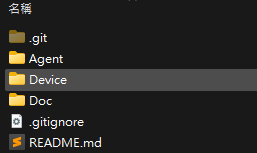
    + $ Click to open "TrustZone.uvmpw". Keil uVision will launch. This is a multiple project editor (include both TrustZone Secure project & Nonsecure project). The project configuration should be already set in the repository. You can check the configuration by clicking the "Manage Project Items" & "Configure target options" buttons.
        + 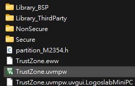
        + 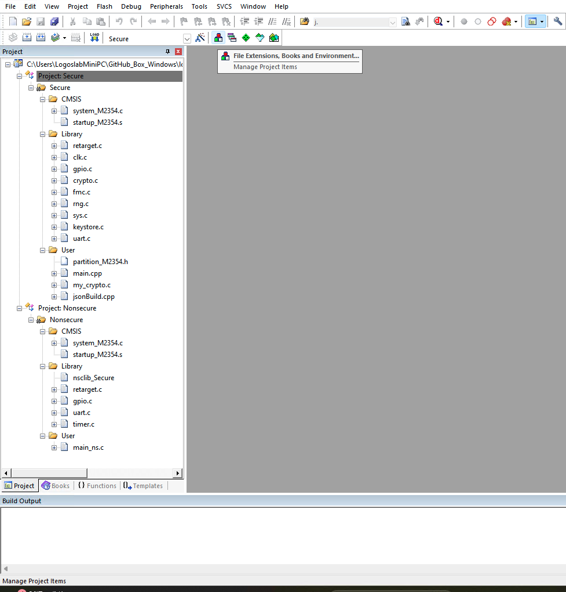
        + 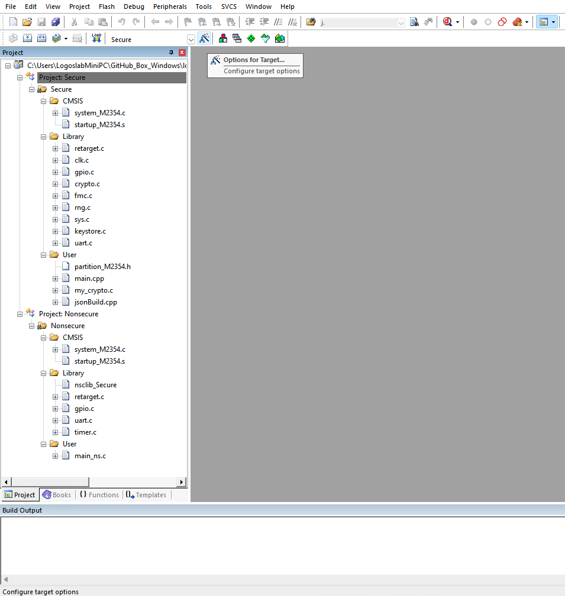
    + $ Click the "batch build" button.
        + 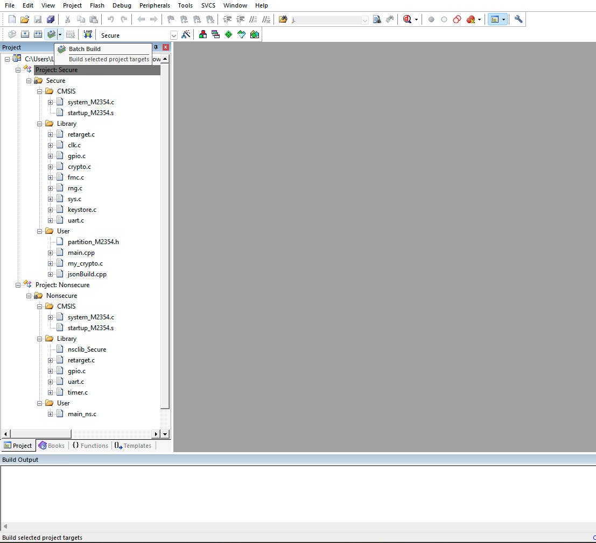
        + 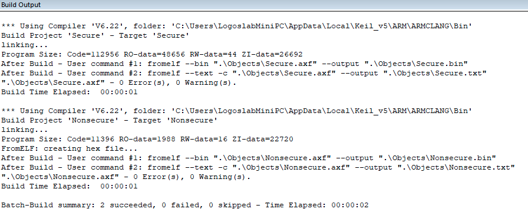
    + $ Plug the M2354 board into the computer through the USB cable. The board should be recognized by the computer.
        + 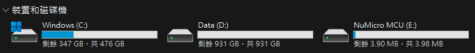
    + $ Right-click on the "Project: Secure" and choose "Set as Active Project"
        + 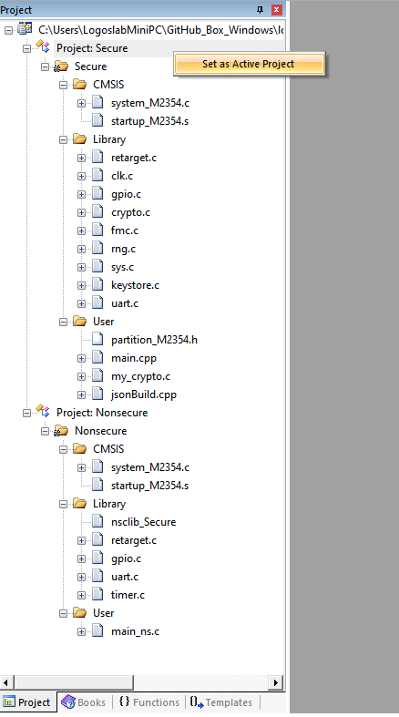
    + $ Click the "Download" button to initiate the flashing process and load the secure program into the board.
        + 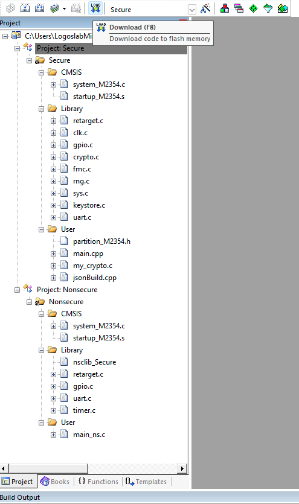
        + 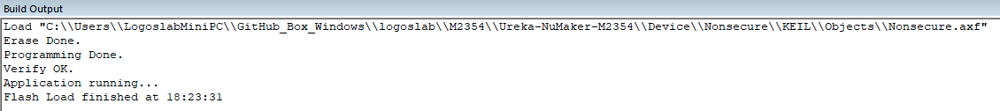
    + $ Right-click on the "Project: Nonsecure" and choose "Set as Active Project"
        + 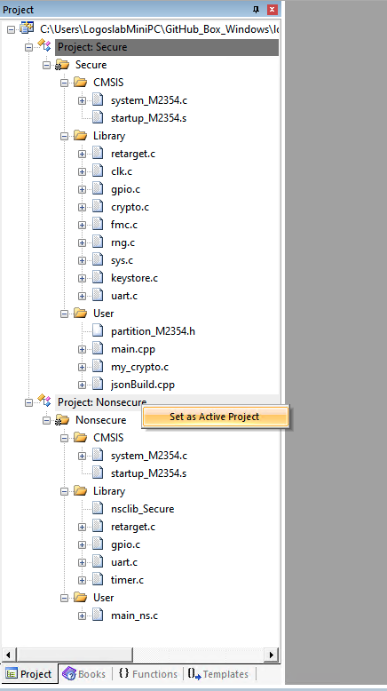
    + $ Click the "Download" button to initiate the flashing process and load the nonsecure program into the board.
        + 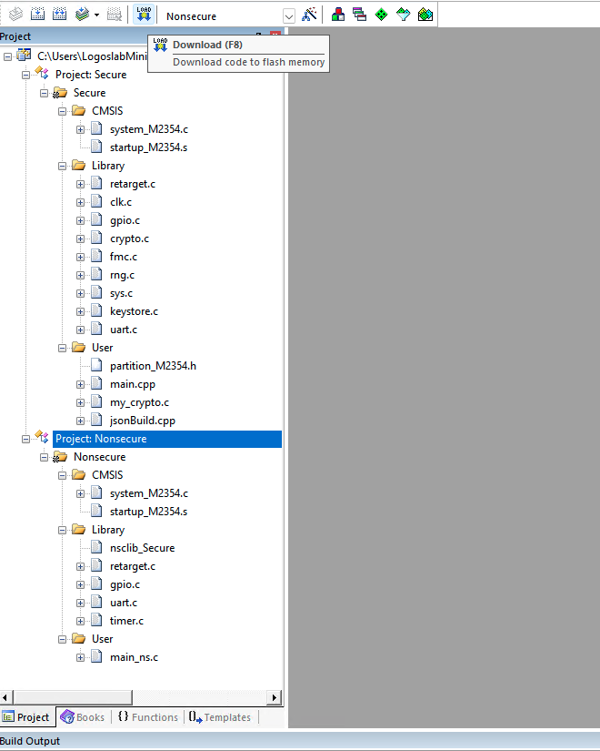
        + 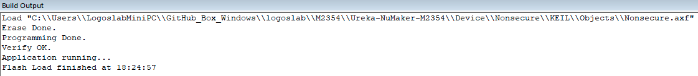
    + $ We can moreover use virtual COM port (baud rate = 115200) to verify whether the board is successfully running the secure & nonsecure program. Following logs should be shown in the terminal after reloaded or reset. 
        + 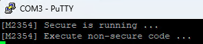
### Setup Python Agent
  + #### Tutorial
    + [Python in Visual Studio Code](https://code.visualstudio.com/docs/languages/python)
  + #### Install Python Environment and Required Packages
    ```
    # Build a Python Virtual Environment (Venv) in /Agent
    $ cd Agent
    $ python -m venv .venv
    $ VSCode may help you set python interpreter through GUI (.venv\Scripts\python.exe)
    ├─ $ OR you can also manually activate the python venv in VSCode Terminal 
    └─ $ .\.venv\Scripts\Activate.ps1 (if your VSCode take PowerShell as default terminal)
    # Check whether you are in the Python Virtual Environment 
    $ Get-Command python; Get-Command python3; Get-Command pip; Get-Command pip3;

    # Install Required Python Packages
    $ pip install -r requirements_Windows_python3.13.1.txt
    
    # Update the document if the developer adds new Python packages 
    $ pip install new_package_name
    $ pip freeze > requirements_Windows_python3.13.1.txt
    $ vim requirements-top.txt (manually add the description for new package)
    ```
### Run the Test
  + To accelerate the development cycle and improve quality, more comprehensive tests should be added...

## Example Application

### Protect E-Voting througth Ureka framework and M2354's security features
  + #### About the E-Voting Application
    + The Ureka framework and M2354's security features can generally protect different appliciations or services.
    + Currently, the `Device/Secure/main.cpp` and the `Agent/voting_emulation.py` run the simple example to simulate a voting scenario.
      + Many agents (manufacturer, voting admin, voters) will be involed in the voting, and access the device (voting machine) to perform their tasks. The Ureka protcol protects the communications. 
    + However, the security system should be better decoupled from the application, which maybe the next step of this project...
  + #### Run the E-Voting Application
    + Check the port number the M2354 connected to the computer
      + 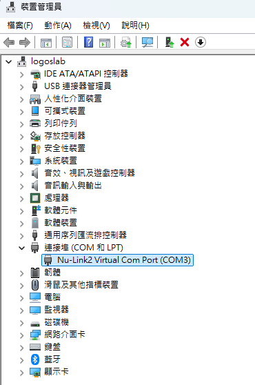
    + Modify the `serial_port_number` in `voting_emulation.py` to make sure your python code can find the correct serial port connected to the M2354
    ```
    # Enter the Agent folder
    $ cd Agent

    # Run the startup python file in the Python Virtual Environment
    $ python voting_emulation.py
    ```
